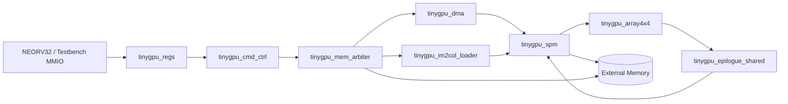
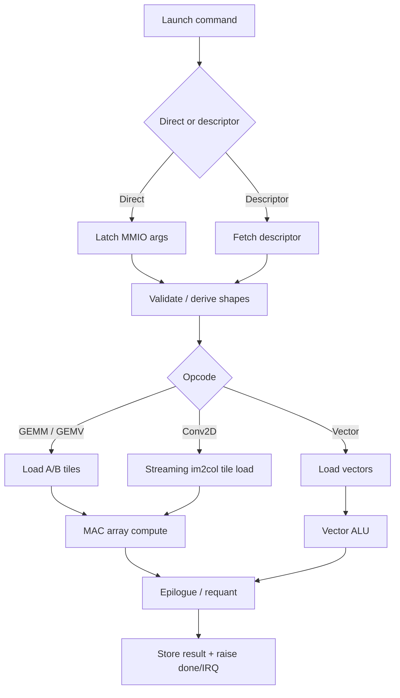

# Demo Prep

This file is a presentation-oriented guide for showing TinyGPU-ML as a class
project in the design of hardware accelerators course.

## 1. Project One-Liner

TinyGPU-ML is a command-driven INT8 ML accelerator written in SystemVerilog for
NEORV32-style SoC integration. It accelerates matrix-heavy inference kernels
using a tiled `4x4x16` compute engine, supports vector operations and
Conv2D-via-streaming-im2col, and is backed by simulation, coverage, and
focused formal checks.

## 2. Problem Statement

The project addresses a standard accelerator-design problem:

- a small embedded CPU is inefficient for dense ML arithmetic
- GEMM is the core kernel behind fully connected layers and many convolution
  implementations
- an accelerator should improve throughput by exploiting parallel MACs, local
  scratchpad storage, and structured command sequencing

The core design question is:

- how do we build a compact ML accelerator that is still architecturally clean,
  verifiable, and synthesizable on realistic FPGA-class targets?

## 3. Architecture Overview

The canonical RTL is under [`rtl/`](rtl/).

High-level blocks:

- `tinygpu_top.sv`: top-level MMIO + memory-master wrapper
- `tinygpu_regs.sv`: MMIO register file and command interface
- `tinygpu_cmd_ctrl.sv`: controller / scheduler / state machine
- `tinygpu_dma.sv`: tile movement between external memory and scratchpad
- `tinygpu_spm.sv`: tile scratchpad memory
- `tinygpu_array4x4.sv` + `tinygpu_pe.sv`: compute array
- `tinygpu_epilogue_shared.sv`: serialized postprocess path
- `tinygpu_vec_alu.sv`: vector operation path
- `tinygpu_im2col_loader.sv`: hardware Conv2D lowering frontend
- `tinygpu_mem_arbiter.sv`: shared memory-client arbitration
- `tinygpu_counters.sv`: cycle / active / stall / command counters

Canonical compute configuration:

- `TILE_M = 4`
- `TILE_N = 4`
- `TILE_K = 16`
- 16 parallel INT8 MACs
- INT32 accumulation
- serialized epilogue for lower area

## 4. Datapath and Controller Flow

For GEMM-like execution, the flow is:

1. CPU programs MMIO registers or points to a descriptor.
2. Controller validates the command and computes tile bounds.
3. DMA loads A and B tiles into scratchpad.
4. The `4x4` PE array computes partial sums across `K=16`.
5. Completed INT32 results go through epilogue processing.
6. Results are stored back as either INT32 or requantized INT8.

For Conv2D:

1. Software provides input/weight/output addresses and convolution parameters.
2. `tinygpu_im2col_loader.sv` generates only the needed activation tile.
3. It injects zeros for padding and avoids forming a full im2col matrix.
4. The existing GEMM datapath consumes the generated activation tile.
5. The same epilogue and store path handle the outputs.

This is useful to emphasize in the talk:

- the design does not implement a separate convolution array
- it reuses the GEMM engine by lowering convolution into matrix-style tiles in
  hardware

## 5. Inputs and Outputs

### Inputs to the accelerator

The accelerator is launched through MMIO registers.

Main inputs:

- opcode
- source addresses
- destination address
- dimensions `M`, `N`, `K` for GEMM/GEMV/vector-style jobs
- convolution shape/config registers for Conv2D
- flags for bias, ReLU, clamp, requantization, and destination format
- optional descriptor address in descriptor mode

External memory supplies:

- packed INT8 activation tiles
- packed INT8 weight tiles
- optional INT32 bias values

### Outputs from the accelerator

The main architectural outputs are:

- result tensor / matrix / vector written back to memory
- status bits: done and error conditions
- interrupt pending status
- performance counters:
  - cycle count
  - active cycle count
  - stall count
  - command count

## 6. What Operations Are Supported

Current supported operations:

- GEMM
- GEMV reuse of the same tiled engine
- vector add
- vector multiply
- vector ReLU
- vector clamp
- hardware Conv2D through streaming im2col

Supported post-processing:

- optional bias add
- optional ReLU
- optional clamp
- optional requantization
- INT32 destination
- INT8 destination

## 7. Direct Mode vs Descriptor Mode

Direct mode:

- the CPU writes all command fields directly through MMIO registers
- best for debug, bring-up, and testbenches
- easiest mode to explain in waveforms and deterministic demos

Descriptor mode:

- the CPU writes a descriptor in memory and launches the accelerator with
  `CMD_ADDR`
- better represents a realistic command-driven accelerator interface
- demonstrates decoupling between software setup and hardware execution

Suggested explanation in the presentation:

- direct mode is the simplest path for testing and visibility
- descriptor mode is closer to how real accelerators batch work and reduce
  per-command software overhead

## 8. Conv2D Mapping

Important talking point:

- this accelerator does not use dedicated convolution hardware
- instead, it uses hardware streaming im2col to feed the GEMM array

That means:

- activations are interpreted in NHWC layout
- weights are interpreted as `[KH][KW][Cin][Cout]`
- each output position is converted into a dot product against a flattened
  kernel window
- the controller reuses the existing GEMM compute path rather than duplicating
  another datapath

Why this is a good design choice for a class project:

- it shows architectural reuse
- it keeps the compute core general
- it is easier to verify than building a separate convolution-specific engine

## 9. Deterministic Demo Output

The cleanest live demo is:

```bash
make demo-rtl
```

Current deterministic transcript:

```text
Direct GEMM C = [[19, 22], [43, 50]]
Direct GEMM perf: cycles=124 active=2 stalls=65 work=8 ops/cycle=0.064 stall=52%
Descriptor GEMM C = [[19, 22], [43, 50]]
Descriptor GEMM perf: cycles=194 active=2 stalls=135 work=8 ops/cycle=0.041 stall=69%
Vector add z = {6, 4, -4, 12}
Vector add perf: cycles=61 active=8 stalls=47 work=4 ops/cycle=0.065 stall=77%
Conv2D out row0 = {1, 2, 3}
Conv2D out row1 = {4, 5, 6}
Conv2D out row2 = {7, 8, 9}
Conv2D perf: cycles=888 active=27 stalls=695 work=81 ops/cycle=0.091 stall=78%
Last command cycles : 888
Last command active : 27
Last command stalls : 695
Commands completed : 4
```

What this demo proves:

- direct-mode launch works
- descriptor-mode launch works
- tiled GEMM datapath works
- vector path works
- Conv2D mapping works
- counters are alive and observable

### Performance story from the deterministic demo

The per-command counters are for the last completed command, not cumulative
from reset. That makes them good for a compact per-kernel performance table.

| Kernel | Math result shown in demo | Scalar work reference | Cycles | Active | Stalls | Ops/cycle | Stall % | First-order read |
|---|---|---:|---:|---:|---:|---:|---:|---|
| Direct GEMM | `[[19,22],[43,50]]` | 8 MACs | 124 | 2 | 65 | 0.064 | 52% | control + memory dominated |
| Descriptor GEMM | `[[19,22],[43,50]]` | 8 MACs | 194 | 2 | 135 | 0.041 | 69% | descriptor fetch adds overhead |
| Vector add | `{6,4,-4,12}` | 4 adds | 61 | 8 | 47 | 0.065 | 77% | setup/memory dominated |
| Conv2D | rows `{1,2,3}`, `{4,5,6}`, `{7,8,9}` | 81 scalar mul/add ops | 888 | 27 | 695 | 0.091 | 78% | strongest memory/control pressure |

How to explain this in the presentation:

- these are tiny correctness-oriented workloads, so setup and memory overhead
  dominate more than raw array throughput
- the counters already let you separate useful activity from stall time
- the next natural extension is collecting the same numbers for larger kernels
  and comparing them against a software-only NEORV32 baseline

That gives you a credible performance story without overselling these toy-sized
demo jobs as peak-throughput measurements.

## 10. Verification Story

### Simulation-based verification

Run the full Icarus regression:

```bash
make test
```

This covers:

- PE behavior
- array behavior
- DMA behavior
- epilogue behavior
- tile-level GEMM
- register file behavior
- controller idle/basic behavior
- top-level GEMM / edge tiles / INT8 store / bias+ReLU / clamp / Conv2D
- randomized memory-latency behavior

### Verilator differential testing

Run:

```bash
make verilator-diff
```

This compares RTL behavior against a C++ reference model over 1000
deterministic jobs with randomized backpressure.

Current classes:

- GEMM
- vector
- Conv2D
- negative/error jobs

Current functional coverage:

- `100.00% (32/32 bins)`

### Python golden-model story

There is also an independent Python-based verification flow under
[`sw integration/neorv32-setups/neorv32/tinygpu_golden_verification/`](sw%20integration/neorv32-setups/neorv32/tinygpu_golden_verification).

What it adds beyond the main RTL regressions:

- a pure Python learning/reference path:
  - `step1_convolution.py`
  - `step2_im2col.py`
  - `step3_golden_model.py`
- a Python-versus-hardware comparison script:
  - `step4_compare_hardware.py`
- a cocotb testbench:
  - `test_tinygpu.py`

Why this matters in the demo:

- it gives you an independent golden model, not just self-checking RTL tests
- it makes the Conv2D/im2col math easier to explain at a high level
- it shows a standard HW/SW co-design verification pattern:
  software reference model plus hardware DUT comparison

Important nuance to say clearly:

- the canonical repository-wide randomized differential harness is C++/Verilator
- the Python golden suite is an additional reference/teaching/validation path
- the Python scripts still describe the algorithm in im2col terms, but the
  actual accelerator performs the lowering in hardware through
  `tinygpu_im2col_loader.sv`

### Formal checks

Run:

```bash
make formal
```

The formal setup under [`formal/`](formal/) proves focused invariants for:

- memory arbiter
- counters
- DMA
- im2col loader
- register protocol
- controller direct-vector bounded progress

This is block-level formal, not full-top formal closure.

## 11. Coverage: What the Numbers Mean

Current merged Verilator coverage run:

- RTL-only line coverage: `94.35% (2338/2478)`
- RTL-only branch coverage: `24.59% (35025/142452)`
- functional coverage: `100.00% (32/32 bins)`

How to explain this clearly:

- line coverage asks: did this line execute?
- branch coverage asks: did both decision outcomes occur?
- functional coverage asks: did we hit the behaviors we explicitly care about?

Why branch coverage is much lower:

- `tinygpu_cmd_ctrl.sv` has many states, flags, edge cases, and error paths
- Verilator counts a very large number of decision branches
- many branches are rare, intentionally defensive, or split into many implicit
  outcomes by wide conditionals and state decoding
- merged directed benches improved line execution a lot, but the controller
  still dominates the remaining uncovered decision space

Suggested wording for the presentation:

- line coverage is strong and functional coverage is full for the planned bins
- branch coverage is the weakest metric today
- but functional coverage and directed behavior-level verification are much
  stronger than the raw branch percentage alone suggests
- the biggest remaining verification closure opportunity is controller branch
  closure, not basic arithmetic correctness

## 12. Why RTL Verification Logic Was Added

The project now includes verification-oriented assertions and properties in the
RTL and formal wrappers.

Reason:

- output-only testing cannot reliably prove protocol invariants
- some failures are internal consistency bugs rather than wrong final math

Examples of what these checks target:

- no unexpected read response without an outstanding request
- no illegal MAC activity outside compute states
- no padded Conv2D coordinate becoming a real memory read
- bounded progress for DMA and im2col under fair memory assumptions
- register interface pulse behavior

Industry-style point:

- this is normal practice
- assertions may live in RTL, in bind files, or in formal wrappers

## 13. Resource / Timing / Scaling Tradeoffs

One of the strongest academic aspects of this project is the design-space story.

What happened:

- larger configurations are architecturally more attractive
- but small FPGA targets make area and timing much tighter
- this forced architectural tradeoffs such as:
  - serialized epilogue
  - shared multiplier reuse
  - tighter scratchpad organization
  - smaller feasible SoC-integrated variants in some target flows

Why this is valuable in a course project:

- it shows the difference between a clean paper architecture and a practical
  implementable architecture
- it demonstrates real hardware-accelerator co-design tradeoffs

## 14. What Is Verified vs What Is Assumed

Verified reasonably well:

- arithmetic blocks
- tile-level datapath behavior
- MMIO register behavior
- direct-mode and descriptor-mode execution
- vector operations
- Conv2D lowering behavior
- many edge cases and error paths
- memory-latency stress in simulation
- selected local properties with formal methods

Not fully closed:

- full branch coverage
- full-chip formal proof
- all possible controller-state interleavings
- ASIC-style signoff or production IP qualification

This honesty is important and strengthens the presentation rather than hurting
it.

## 15. Recommended Demo Structure

A good 8-12 minute demo flow:

1. Problem statement and why GEMM matters.
2. Show the block diagram / module hierarchy.
3. Explain the `4x4x16` tiling idea.
4. Explain direct mode vs descriptor mode.
5. Explain hardware Conv2D via streaming im2col.
6. Run `make demo-rtl` and show the output.
7. Summarize verification evidence.
8. Summarize area/timing/resource tradeoffs.
9. End with limitations and future work.

### One-slide diagram options

Compute/dataflow view:



Execution-flow view:



## 16. Likely Questions You Should Be Ready For

- Why use im2col instead of dedicated convolution hardware?
- Why is branch coverage low while functional coverage is high?
- What does the controller do versus the DMA?
- Why direct mode and descriptor mode both?
- What is the bottleneck: compute, memory, or control?
- What did FPGA constraints force you to change?
- What would be the next step toward a stronger accelerator?

### Suggested answers

#### Why use im2col instead of dedicated convolution hardware?

Because the project already had a general GEMM-style MAC array, and im2col lets
us reuse that engine for convolution instead of building a second specialized
datapath. That reduced design complexity, reused the same compute array,
scratchpad, epilogue, and store path, and made verification much more
manageable. In this design, the lowering is done in RTL by
`tinygpu_im2col_loader.sv`, so software does not build the full im2col matrix.

#### Why is branch coverage low while functional coverage is high?

Functional coverage is based on the behaviors we intentionally targeted:
GEMM, vector ops, Conv2D modes, error paths, requantization, descriptor mode,
and so on. That is why it can be high. Branch coverage is lower because
`tinygpu_cmd_ctrl.sv` contains a lot of control decisions, defensive cases,
state transitions, and flag combinations, and Verilator counts all of those
branches very aggressively. So the design behavior is well covered at the
feature level, but not every internal controller decision outcome has been hit.

#### What does the controller do versus the DMA?

The controller is the scheduler and orchestrator. It validates commands,
computes derived dimensions, decides which operation is being run, sequences
states like load/compute/store, handles direct versus descriptor mode, and
raises done or error status. The DMA is narrower in scope: it only performs the
actual memory movement between external memory and local scratchpad or output
storage when asked to do so by the controller.

#### Why direct mode and descriptor mode both?

Direct mode is the simplest bring-up and debug interface: software writes the
registers and launches immediately, which is ideal for waveforms, unit tests,
and deterministic demos. Descriptor mode is closer to a realistic accelerator
programming model because software can prepare a command block in memory and
then launch it with less MMIO traffic. Having both lets us show both easy
debuggability and a more realistic command-driven interface.

#### What is the bottleneck: compute, memory, or control?

For the small demo workloads, the bottleneck is mostly memory/control overhead,
not raw arithmetic throughput. The counter results show relatively high stall
percentages, which means setup, reads, writes, and orchestration dominate these
tiny jobs. For larger workloads, compute utilization would matter more, but in
this presentation the honest story is that the demo kernels are correctness
oriented and overhead dominated.

#### What did FPGA constraints force you to change?

The FPGA constraints forced architectural tradeoffs. We could not just keep
everything fully parallel at all times, especially in smaller-board studies, so
the design moved toward a serialized/shared epilogue, tighter scratchpad
organization, shared multiplier reuse, and more timing-aware control/memory
structuring. In other words, the constraints pushed the project from a more
idealized architecture toward a more implementation-conscious one.

#### What would be the next step toward a stronger accelerator?

The next strongest steps would be:

- improve controller branch closure further, especially in `tinygpu_cmd_ctrl`
- strengthen formal liveness/progress proofs around controller and arbiter
- gather performance numbers on larger workloads and compare against a software
  baseline
- if area allowed, explore a less serialized postprocess/memory path to improve
  utilization

That answer shows both verification maturity and clear awareness of the next
engineering bottlenecks.

## 17. Suggested Improvements

If you want to make the project stronger beyond its current state, the best
next improvements are:

### Verification improvements

- keep attacking `tinygpu_cmd_ctrl.sv` uncovered branches with descriptor,
  bias, error, and mixed-flag scenarios
- move some assertions into separate bind files for cleaner verification
  structure
- expand formal from bounded local progress to stronger controller/arbiter
  liveness under fairness assumptions
- add a regression summary script that prints one combined verification report

### Architecture improvements

- pipeline or structurally simplify the controller decision logic
- improve memory-system realism with more arbitration and backpressure cases
- add a more explicit top-level block diagram and state-flow diagram to the
  docs
- expose more performance metrics such as per-op counters or tile counts

### Demo/presentation improvements

- create one clean architecture figure for the slides
- capture one representative waveform for direct GEMM and one for Conv2D
- add a one-page “results summary” table:
  - operations supported
  - tests passing
  - functional coverage
  - line coverage
  - branch coverage
  - formal tasks passing

### Software/integration improvements

- improve software-side transcript polish further
- add one more end-to-end firmware-oriented validation script
- keep the MMIO ABI summary in one table used by both docs and code

## 18. Bottom-Line Assessment

For a class project, this is in a strong state:

- architecturally meaningful
- implementation-heavy
- verification-aware
- honest about tradeoffs and limitations

It is appropriate to demo as a hardware accelerators course project, especially
if presented as a serious accelerator prototype with measured verification and
clear future work rather than as “fully complete industrial IP”.
